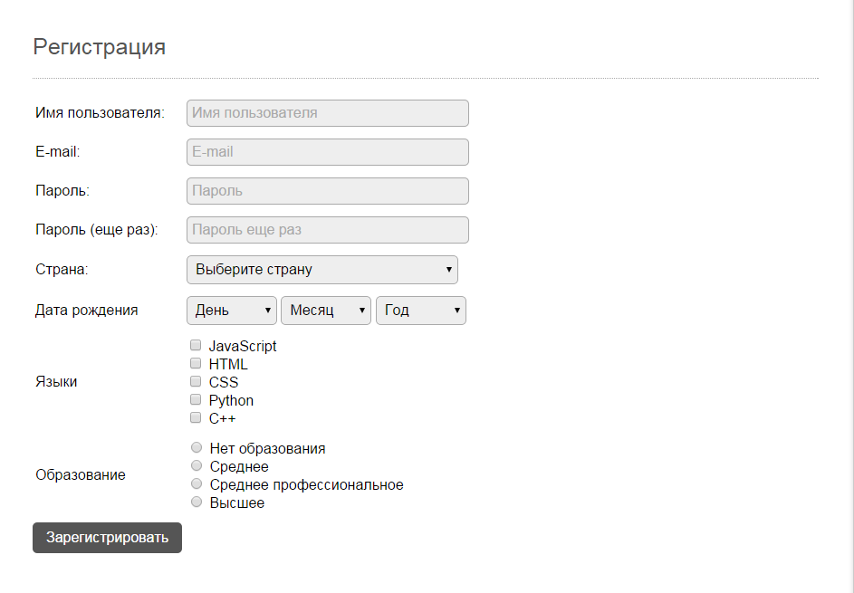

# 1. Формы

## Задача

Создать форму регистрации со следующими полями:

* **Имя пользователя**: Текстовое поле.
* **E-mail**: Текстовое поле.
* **Пароль**, **Пароль (еще раз)**: Поля ввода пароля.
* **Страна**: Выпадающий список с выбором из нескольких стран (минимум 5 значений).
* **Дата рождения**: 3 выпадающих списка (день, месяц и год). Диапазон годов - с 1990 по 2010.
* **Языки**: Чекбоксы.
* **Образование**: радио-кнопки.